<p align="center">
  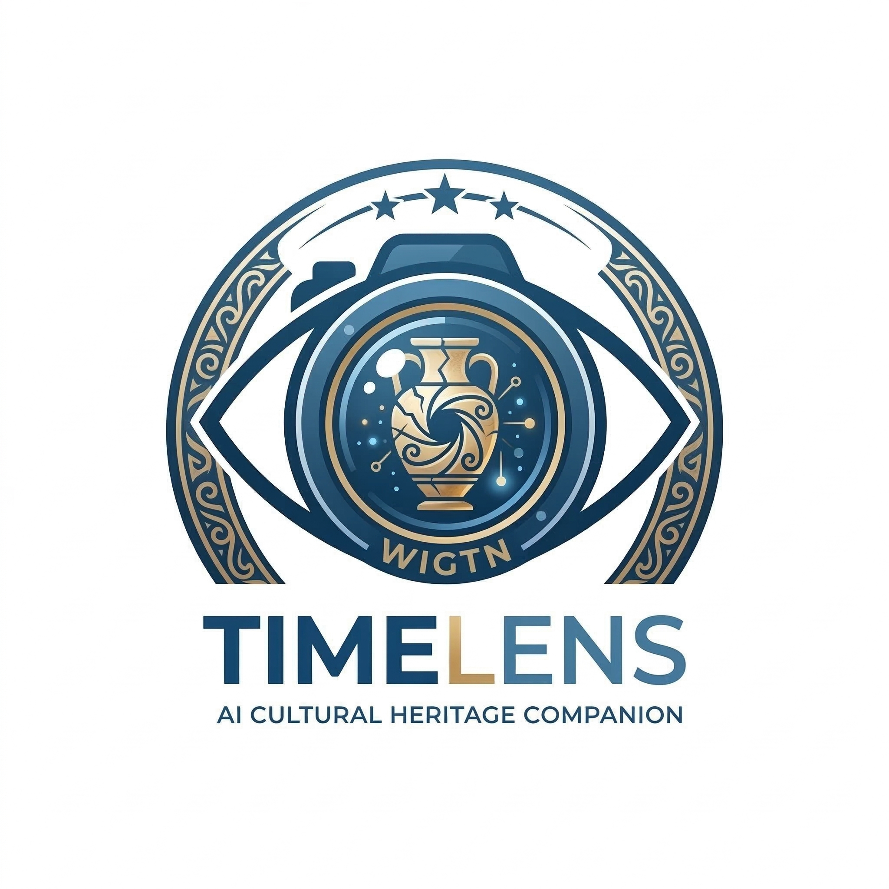
</p>

<p align="center">
  <strong>AI 문화유산 컴패니언</strong><br/>
  박물관 유물에 생명을 불어넣는 실시간 대화, 이미지 복원, 인터랙티브 탐험.
</p>

<p align="center">
  <a href="README.md">English</a> · <a href="README.ko.md">한국어</a>
</p>

<p align="center">
  
  
  
  
  
  
  
  
  
</p>

**Gemini Live Agent Challenge** 출품작.

## UX 플로우

### 온보딩

<p align="center">
  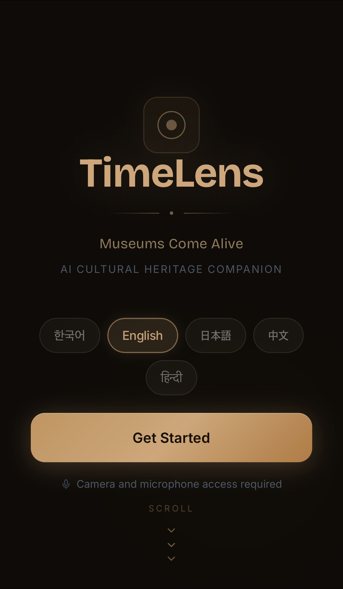
  &nbsp;&nbsp;
  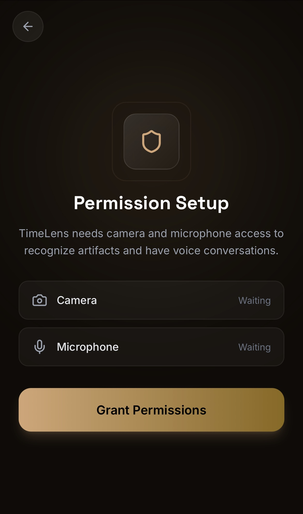
  &nbsp;&nbsp;
  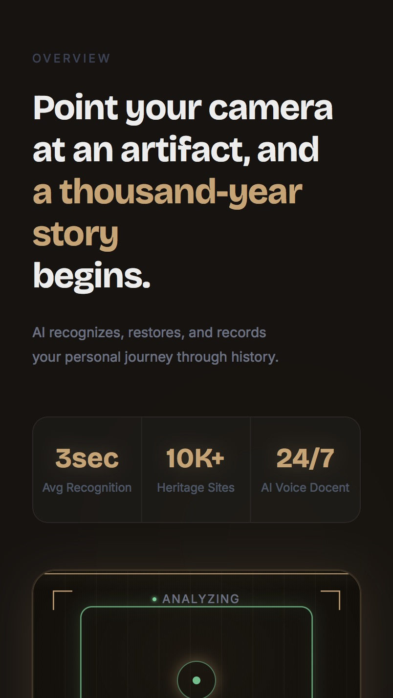
</p>

<p align="center">
  <em>언어 선택 후 시작 → 카메라 & 마이크 권한 허용 → "카메라를 유물에 비추면, 천 년의 이야기가 시작됩니다."</em>
</p>

### 세션 시작

<p align="center">
  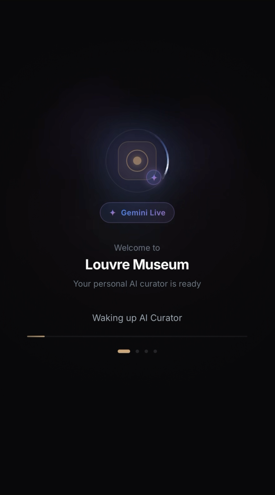
  &nbsp;&nbsp;
  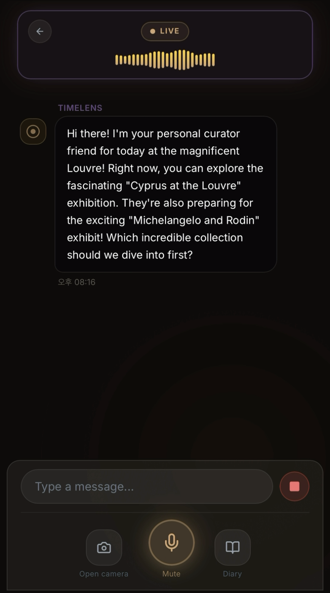
</p>

<p align="center">
  <em>Gemini Live 세션이 박물관 정보와 함께 초기화 → AI 큐레이터가 Google Search Grounding으로 오늘의 전시 정보를 안내</em>
</p>

### 라이브 경험

<p align="center">
  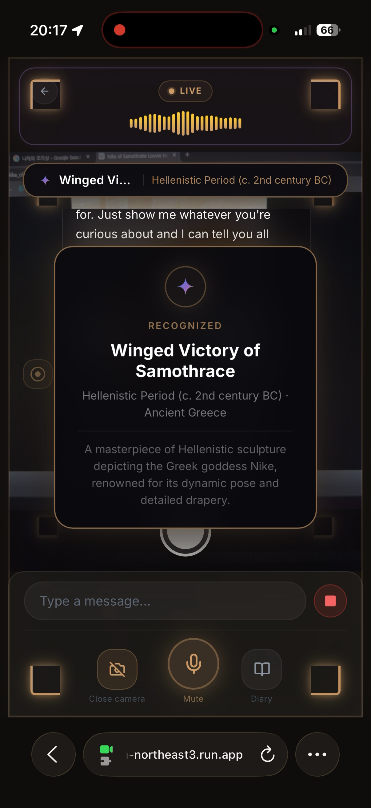
  &nbsp;&nbsp;
  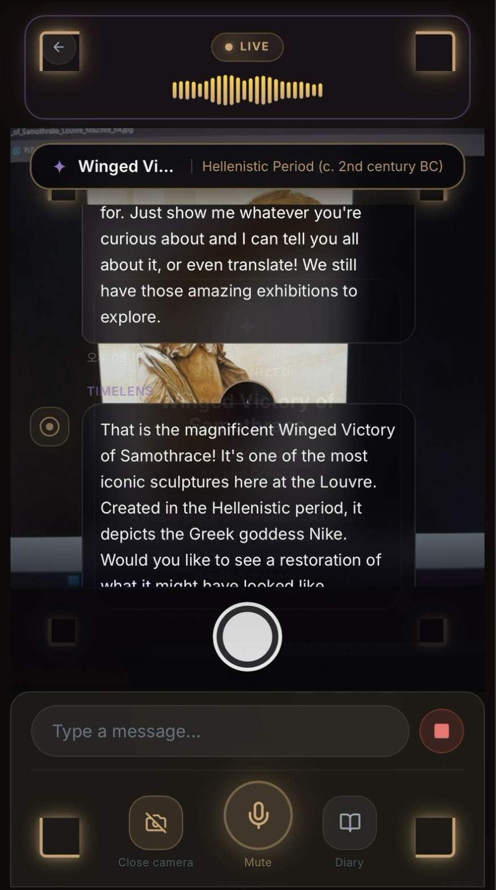
  &nbsp;&nbsp;
  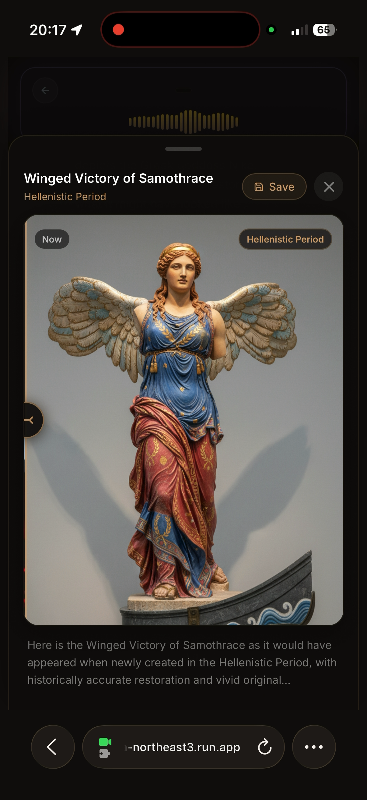
</p>

<p align="center">
  <em>recognize_artifact가 사모트라케의 니케를 실시간 인식 → 역사 해설과 함께 음성 대화 → AI가 헬레니즘 시대 원래 모습을 복원</em>
</p>

## 주요 기능

- **AI 큐레이터** — Gemini Live API 기반 실시간 음성/영상 대화. 카메라로 유물을 비추고 자연스럽게 질문하세요.
- **유물 인식** — 카메라를 통해 유물을 식별하고 시대, 문명, 역사적 맥락을 제공합니다.
- **이미지 복원** — Gemini Flash로 손상된 유물의 원래 모습을 복원합니다.
- **주변 탐험** — Google Places API로 현재 위치 근처의 박물관과 문화유산을 찾아줍니다.
- **방문 다이어리** — 박물관 방문을 요약한 일러스트 다이어리를 자동 생성합니다.
- **박물관 온보딩** — 시작 전 박물관을 선택하면 AI가 해당 박물관의 전시 정보를 파악하고 맥락 있는 인사로 시작합니다.

## 기술 스택

| 레이어 | 기술 |
|--------|-----|
| 프론트엔드 | Next.js 15, React 19, TypeScript 5, Tailwind CSS 4 |
| AI | Gemini Live API, Google ADK, `@google/genai` |
| 데이터베이스 | Firebase Firestore, Firebase Auth |
| 지도 | Google Places API (New), Geolocation API |
| 배포 | Docker, Cloud Run (서울), GitHub Actions CI/CD |

## 시작하기

### 사전 요구사항

- **Node.js 20+**, **npm 10+** — [다운로드](https://nodejs.org/)
- **Google Chrome** 권장 — 마이크 & 카메라 권한이 Chrome에서 가장 안정적입니다
- API 키 (아래 Step 2 참고)

### Step 1: 클론 & 설치

```bash
git clone https://github.com/wigtn/wigtn-timelens.git
cd wigtn-timelens
npm install
```

### Step 2: API 키 준비

```bash
cp .env.example .env.local
```

#### 2-1. Gemini API 키 (필수)

**이 키 하나만 있으면** 핵심 기능을 모두 사용할 수 있습니다: 음성 대화, 유물 인식, 이미지 복원, 방문 다이어리.

1. [Google AI Studio](https://aistudio.google.com/apikey)에서 **"Create API Key"** 클릭
2. `.env.local`에 입력:

```env
GOOGLE_GENAI_API_KEY=your_gemini_api_key_here
```

#### 2-2. Firebase (선택 — 세션 저장용)

Firebase 없이도 앱은 정상 동작합니다. 다만 세션 기록과 다이어리 공유 링크가 페이지 새로고침 시 유지되지 않습니다.

```env
NEXT_PUBLIC_FIREBASE_API_KEY=your_firebase_api_key
NEXT_PUBLIC_FIREBASE_AUTH_DOMAIN=your-project.firebaseapp.com
NEXT_PUBLIC_FIREBASE_PROJECT_ID=your-project-id
```

#### 2-3. Google Maps & Places API 키 (선택 — 주변 탐색용)

이 키 없이도 음성 대화, 유물 인식, 복원, 다이어리 기능은 모두 동작합니다.

```env
NEXT_PUBLIC_GOOGLE_MAPS_API_KEY=your_maps_api_key
GOOGLE_PLACES_API_KEY=your_places_api_key
```

#### 최종 `.env.local` 체크리스트

```env
# Gemini (필수 — 모든 AI 기능)
GOOGLE_GENAI_API_KEY=your_key_here

# Firebase (선택 — 세션 저장 & 다이어리 공유)
NEXT_PUBLIC_FIREBASE_API_KEY=
NEXT_PUBLIC_FIREBASE_AUTH_DOMAIN=
NEXT_PUBLIC_FIREBASE_PROJECT_ID=

# Maps & Places (선택 — 박물관 검색 & 주변 탐색)
NEXT_PUBLIC_GOOGLE_MAPS_API_KEY=
GOOGLE_PLACES_API_KEY=

# 앱 URL (로컬 개발 시 기본값 유지)
NEXT_PUBLIC_APP_URL=http://localhost:3000
```

### Step 3: 실행

```bash
npm run dev
```

**Chrome**에서 [http://localhost:3000](http://localhost:3000)을 열어주세요.

### Step 4: 사용법

1. **권한 허용** — 마이크와 카메라 접근 권한을 허용하세요
2. **박물관 선택** — 근처 목록에서 고르거나, 검색하거나, 건너뛰기
3. **세션 시작** — AI 큐레이터가 전시 정보를 바탕으로 인사합니다
4. **음성 명령 사용**:
   - *"이거 뭐야?"* — 카메라로 유물을 비추세요
   - *"원래 어떻게 생겼어?"* — 복원 이미지 생성
   - *"근처에 박물관 있어?"* — 주변 탐색
   - *"다이어리 만들어줘"* — 방문 다이어리 생성

### 문제 해결

| 문제 | 해결 방법 |
|------|----------|
| 마이크 안됨 | Chrome 주소창 자물쇠 아이콘에서 권한 확인 |
| 카메라 검은 화면 | 다른 앱이 카메라를 사용 중인지 확인 |
| "API key not configured" | `.env.local`에 `GOOGLE_GENAI_API_KEY` 설정 후 `npm run dev` 재시작 |
| 박물관 검색 결과 없음 | Places API 키는 선택 사항 — 설정했다면 GCP Console에서 API 활성화 확인 |
| Firebase 콘솔 경고 | Firebase 키는 선택 사항 — 없어도 앱은 정상 동작합니다 |

## 스크립트

```bash
npm run dev          # 개발 서버 (Turbopack)
npm run build        # 프로덕션 빌드
npm start            # 프로덕션 서버
npm run lint         # ESLint
npm run type-check   # TypeScript 검증
```

## 아키텍처

<p align="center">
  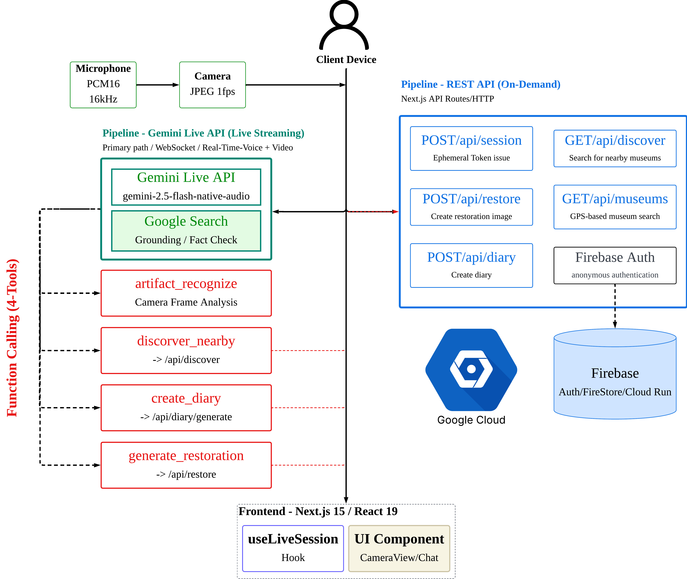
</p>

TimeLens는 **듀얼 파이프라인 아키텍처**로 동작합니다:

- **파이프라인 1 — Live 스트리밍:** Gemini Live API(`gemini-2.5-flash-native-audio`)와의 WebSocket 세션이 앱 사용 내내 열려 있습니다. 마이크 오디오(PCM16, 16kHz)와 카메라 프레임(JPEG, 1fps)이 동시에 모델로 스트리밍되며, 모델은 실시간 음성 응답과 Function Call을 반환합니다.
- **파이프라인 2 — REST 온디맨드:** 이미지 생성, 외부 API 호출 등 무거운 작업은 서버 API 라우트가 처리합니다. 파이프라인 1의 Function Call이 이 라우트를 호출합니다.

### Function Calling 워크플로우

<p align="center">
  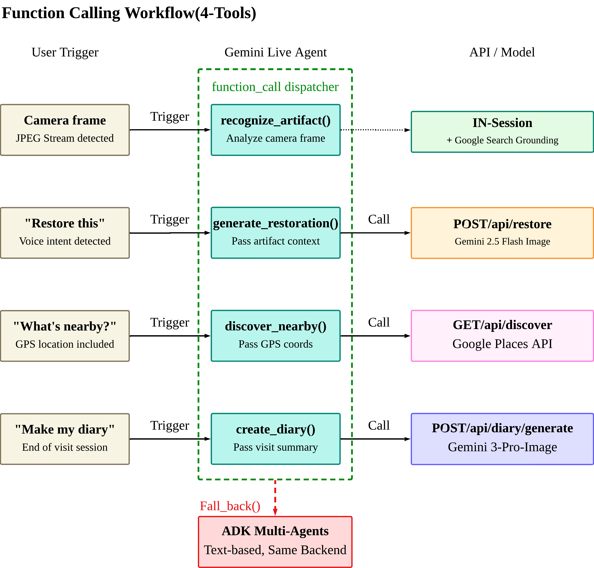
</p>

Gemini Live Agent는 **4개의 Function Declaration**으로 사용자 의도를 라우팅합니다 — 별도의 인텐트 분류기가 필요 없습니다. 모델이 대화 맥락을 보고 스스로 어떤 도구를 호출할지 판단합니다:

| 도구 | 트리거 | 백엔드 | 파이프라인 |
|------|--------|--------|----------|
| `recognize_artifact` | 카메라 프레임 감지 | Gemini Live API + Google Search Grounding | 세션 내부 (REST 호출 없음) |
| `generate_restoration` | "원래 모습 보여줘" | `POST /api/restore` → Gemini 2.5 Flash Image | REST |
| `discover_nearby` | "근처에 뭐 있어?" + GPS | `GET /api/discover` → Google Places API | REST |
| `create_diary` | "다이어리 만들어줘" | `POST /api/diary/generate` → Gemini 3 Pro Image | REST |

> `recognize_artifact`만 유일하게 Live 세션 안에서 처리됩니다 — 카메라 프레임이 이미 스트리밍되고 있으므로, 모델이 Google Search Grounding과 함께 직접 분석합니다. 나머지 3개 도구만 REST 엔드포인트를 호출합니다.

### Google GenAI SDK + ADK

TimeLens는 `@google/genai`와 `@google/adk`를 **모두** 사용합니다:

<table>
<tr>
<th>@google/genai (SDK)</th>
<th>@google/adk (Agent Development Kit)</th>
</tr>
<tr>
<td>

**메인 경로** — 실시간 Live 경험을 담당

- `GoogleGenAI` 클라이언트로 Live API 세션 관리
- `Modality`로 오디오/이미지 스트리밍
- `Type` + `Schema`로 Function Declaration 정의
- 이미지 생성 (Gemini Flash, Gemini 3 Pro)

**10개 소스 파일** — `src/web/`, `src/back/`, `src/shared/`

</td>
<td>

**폴백 경로** — 텍스트 기반 에이전트 오케스트레이션

- `LlmAgent`로 5개 전문 에이전트 구성
- `FunctionTool`로 3개 도구 통합
- `InMemoryRunner`로 에이전트 실행

**에이전트 계층:**
```
timelens_orchestrator
├── curator_agent
├── restoration_agent  → generate_restoration_image
├── discovery_agent    → search_nearby_places
└── diary_agent        → generate_diary
```

</td>
</tr>
<tr>
<td><em>항상 활성 — 음성 + 카메라 스트리밍</em></td>
<td><em>WebSocket 불가 시 활성화</em></td>
</tr>
</table>

두 경로 모두 **같은 백엔드 API를 공유**합니다 — 사용자가 말하든 타이핑하든, 동일한 복원/탐색/다이어리 기능을 사용할 수 있습니다. `npx tsx scripts/adk-demo.ts`로 ADK 에이전트 시연이 가능합니다.

### REST API 라우트

| 라우트 | 역할 | 백엔드 |
|--------|------|--------|
| `POST /api/session` | 세션 생성 + Ephemeral Token | Gemini API |
| `GET /api/museums/nearby` | GPS 기반 박물관 검색 | Places API |
| `GET /api/museums/search` | 텍스트 검색 박물관 | Places API |
| `POST /api/restore` | 유물 복원 이미지 생성 | Gemini Flash |
| `GET /api/discover` | 주변 문화유산 검색 | Places API |
| `POST /api/diary/generate` | 방문 다이어리 생성 | Gemini + Firestore |
| `GET /api/diary/[id]` | 다이어리 조회 | Firestore |

## 프로젝트 구조

```
src/
  app/            # Next.js 페이지 & API 라우트
  shared/         # 공유 타입, Gemini 도구, 설정
  web/            # 클라이언트 컴포넌트 & 훅
  back/           # 서버 로직 (에이전트, 지도, Firebase)
    agents/       # ADK 에이전트 (오케스트레이터 + 4개 전문가)
    agents/tools/ # FunctionTool 구현체
mobile/           # React Native + Expo 앱
scripts/          # ADK 데모 스크립트
firebase/         # Firestore & Storage 보안 규칙
docs/             # PRD, 설계 문서
assets/           # 로고, 아키텍처 다이어그램
.github/          # GitHub Actions CI/CD
```

## 배포

**Google Cloud Run** (asia-northeast3, 서울)에 GitHub Actions로 자동 배포됩니다.

```bash
# 수동 빌드 (선택)
docker build -t timelens .
docker run -p 8080:8080 timelens
```

## Google Cloud 서비스

| 서비스 | 역할 |
|--------|------|
| **Cloud Run** | 프로덕션 배포 (서울 리전) |
| **Firebase Auth** | 익명 인증 |
| **Cloud Firestore** | 세션, 방문 기록, 다이어리 저장 |
| **Google Places API** | 박물관 및 문화유산 검색 |

## 라이선스

이 프로젝트는 [Apache License 2.0](LICENSE)으로 배포됩니다.

Gemini Live Agent Challenge 해커톤 출품작입니다.
